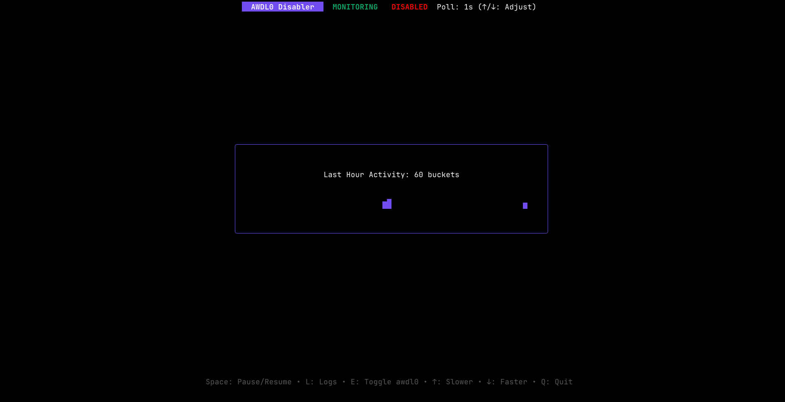

# AWDL0 Disabler (CLI)

A robust, terminal-based monitoring tool for macOS that automatically disables the `awdl0` (Apple Wireless Direct Link) interface when it activates. This helps mitigate WiFi jitter and lag spikes caused by AirDrop/AirPlay scanning.



Built with **Go** and **Bubble Tea**

## ✨ Features

*   **Real-time Monitoring**: Automatically detects when `awdl0` comes UP and disables it.
*   **Visual Dashboard**:
    *   **Activity Graph**: A live histogram showing disable events over the last hour.
    *   **Status Indicators**: Clear visual feedback for Active/Paused states.
*   **Interactive Controls**:
    *   **Pause/Resume**: Toggle monitoring without exiting the app.
    *   **Dynamic Config**: Adjust the polling interval on the fly.
*   **Comprehensive Logging**:
    *   **UI Logs**: Scrollable history of recent events.
    *   **Disk Logs**: Persistent daily logs stored in `~/.awdl0-disabler/logs/YYYY-MM-DD.log`.
*   **Safety**: Automatically restores `awdl0` when you quit the application.

## 🚀 Installation & Usage

### Download and Run

1.  **Download the Binary**:
    *   Go to the [**Latest Release Page**](https://github.com/anderson-oki/awdl0-disabler/releases/latest).
    *   Download the correct binary for your Mac:
        *   `awdl-mon-arm64`: For Apple Silicon Macs (M1, M2, M3, etc.).
        *   `awdl-mon-amd64`: For Intel-based Macs.

2.  **Open Terminal**:
    *   You can find the Terminal app in `Applications > Utilities`.

3.  **Make it Executable**:
    *   Navigate to your Downloads folder (or wherever you saved the file):
      ```bash
      cd ~/Downloads
      ```
    *   Give the file execute permissions. For the `arm64` version, use:
      ```bash
      chmod +x awdl-mon-arm64
      ```
      (Use `awdl-mon-amd64` if you downloaded the Intel version).

4.  **Run the Application**:
    *   Since the tool modifies network interfaces, it needs root privileges. Run it with `sudo`:
      ```bash
      sudo ./awdl-mon-arm64
      ```
    *   You will be prompted to enter your macOS user password.

5.  **Dealing with macOS Gatekeeper**:
    *   The first time you run it, macOS might block the application because it's from an unidentified developer.
    *   If that happens, go to `System Settings > Privacy & Security`, scroll down, and you will see a message about `awdl-mon-arm64` being blocked. Click the "Allow Anyway" or "Open Anyway" button.
    *   You may need to re-run the `sudo` command in the terminal after allowing it.

### For Developers: Build from Source

### Prerequisites
*   macOS
*   Go 1.25+ (to build from source)

### Building
```bash
go build -o build/awdl-mon cmd/awdl-mon/main.go
```

### Running
Since this tool modifies network interfaces, it requires root privileges:

```bash
sudo ./build/awdl-mon
```

### Controls

| Key | Action |
| :--- | :--- |
| **Space** | Pause / Resume monitoring |
| **L** | Toggle Log View / Dashboard |
| **E** | Manual Enable or Disable awdl0 |
| **[** | Decrease Polling Interval (Faster) |
| **]** | Increase Polling Interval (Slower) |
| **Q / Ctrl+C** | Quit (Restores awdl0) |

### ⚠️ Side Effects & Considerations

Disabling the `awdl0` (Apple Wireless Direct Link) interface is a common technique to reduce WiFi jitter and lag spikes on macOS. However, since it is a core Apple technology, disabling it will impact several features:

1.  **AirDrop**: You will not be able to send or receive files via AirDrop.
2.  **AirPlay**: Screen mirroring or streaming to Apple TV/HomePod may fail or be less stable.
3.  **Sidecar**: Wireless connection to an iPad as a second display will not work.
4.  **Continuity & Universal Control**: Features like Handoff, Universal Clipboard, and shared input (mouse/keyboard) will be interrupted.
5.  **Apple Watch Unlock**: Automatic unlocking of your Mac via Apple Watch will be disabled.
6.  **Find My**: The Mac's ability to participate in the offline Find My network may be limited.

#### Why use this tool?
The primary benefit is **WiFi Stability**. macOS periodically scans for AWDL devices, which causes brief but significant latency spikes (ping jumps) and jitter. This tool automates the process of keeping `awdl0` down during sensitive activities like online gaming or video conferencing.

*Note: The application automatically restores the `awdl0` interface when you quit, ensuring these features return to normal immediately.*

## 🏗 Architecture

This project follows **Domain-Driven Design (DDD)** and **Hexagonal Architecture (Ports & Adapters)** principles.

```text
.
├── cmd/                # Application Entry Point
├── internal/
│   ├── core/           # The Hexagon (Pure Business Logic)
│   │   ├── domain/     # Entities (Event, Config)
│   │   ├── ports/      # Interfaces (Network, Logger)
│   │   └── services/   # Application Logic (Monitor, Stats)
│   └── adapters/       # Implementation Details
│       ├── network/    # Shell commands (ifconfig)
│       ├── filesystem/ # Disk I/O
│       └── ui/         # Bubble Tea (TUI)
```

## 🧪 Testing

The core logic is covered by unit tests.

```bash
go test ./...
```
